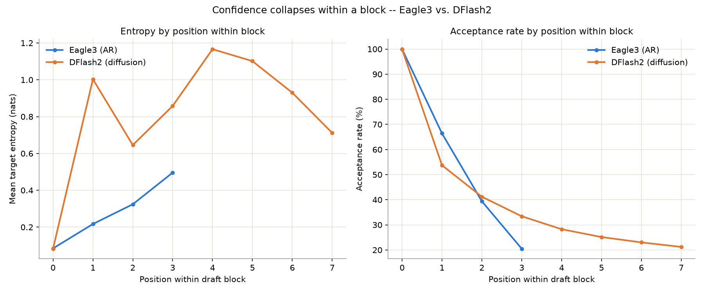
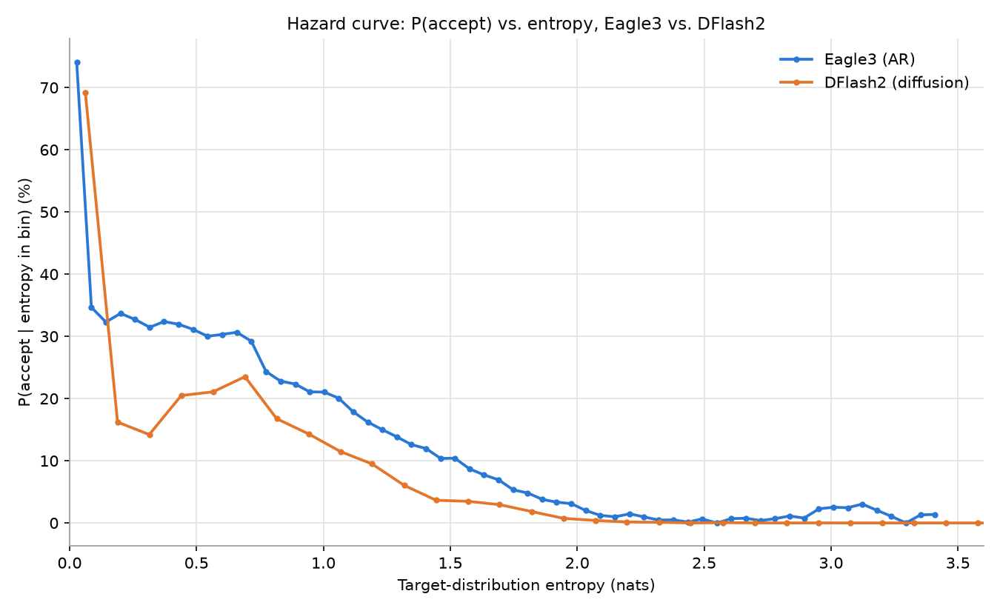
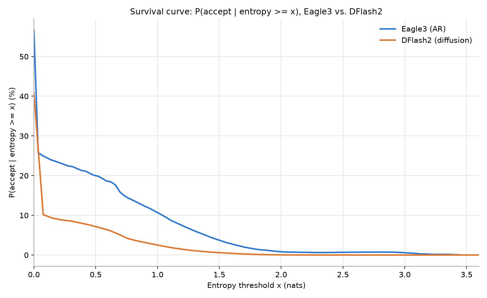
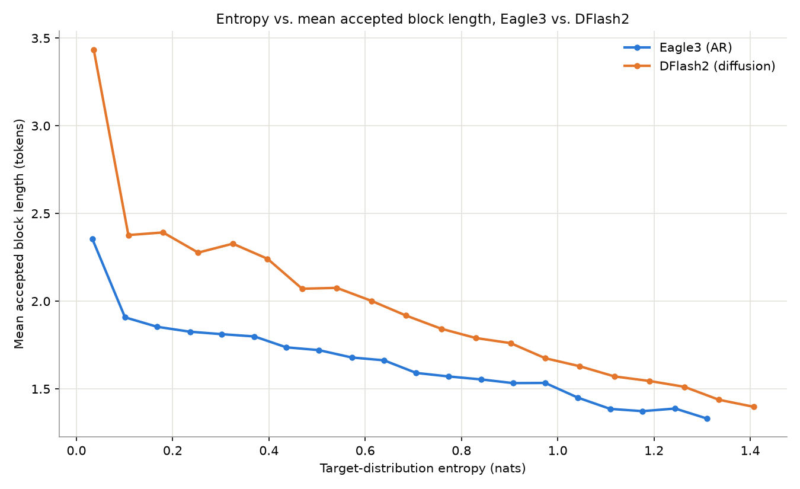
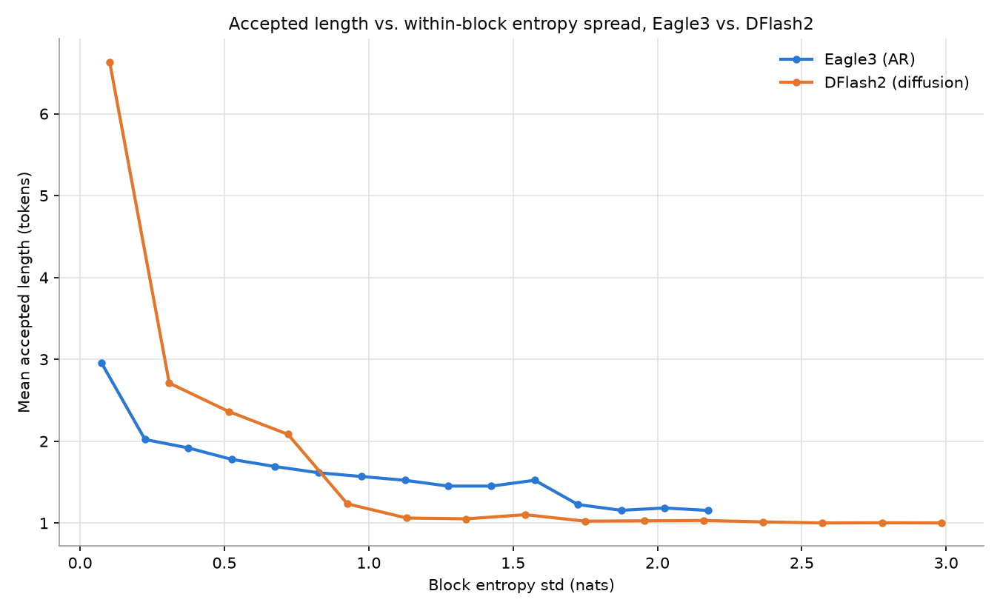
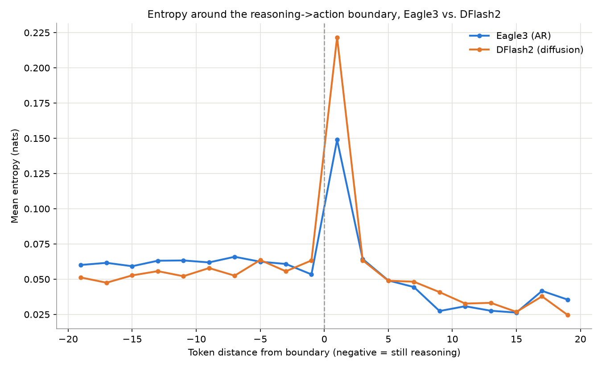
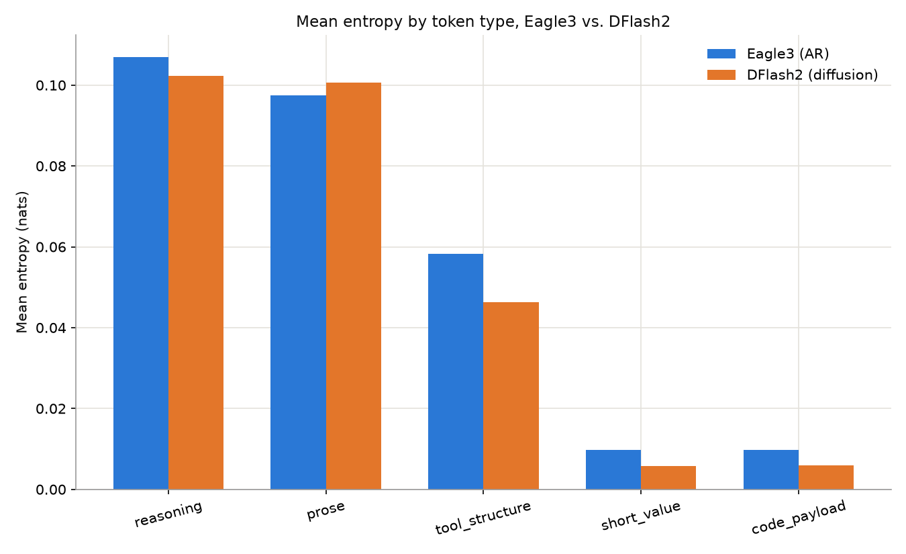
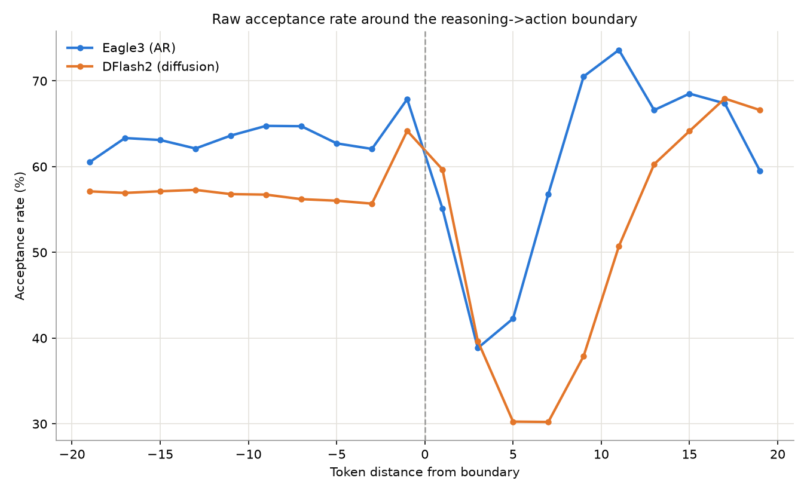
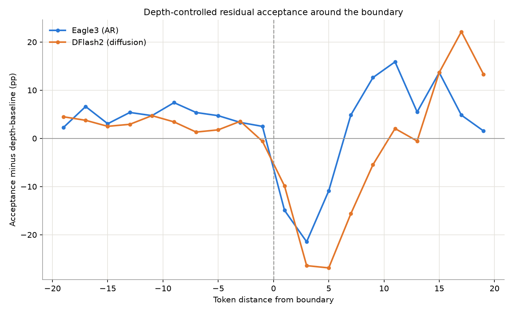
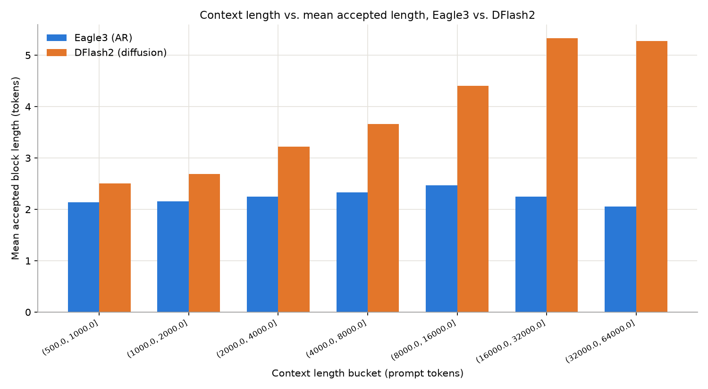

# Eagle3 vs. DFlash2: AR vs. Diffusion Speculators on Qwen3-8B

*A controlled head-to-head: both speculators paired with the exact same target model (`Qwen/Qwen3-8B`), the same 50-task SWE-bench-verified set, and the same agent (mini-swe-agent). This report only uses the Qwen3-8B runs — see [`REPORT.md`](REPORT.md) for the muse-glimmer-30B comparison at a different scale.*

---

## TL;DR

- **Position-matched: DFlash2 wins.** At every matched depth within a draft block, DFlash2 (diffusion) has a higher acceptance rate than Eagle3 (AR), and the gap widens with depth. Mean accepted length: DFlash2 = 3.23 tokens vs. Eagle3 = 2.25 tokens.
- **Entropy-matched: Eagle3 wins — and the flip explains everything.** Held at the same level of target-model uncertainty, Eagle3 accepts more often than DFlash2, by an increasingly large margin as entropy rises (up to ~5x at high entropy). DFlash2's overall lead isn't from guessing better under uncertainty — it's from *encountering* less uncertainty per position in the first place.
- **The two drafters are governed by different internal signals.** Eagle3's block outcome is explained almost entirely by *average* entropy. DFlash2's is explained more by the *spread* of entropy across the block than by the average.
- **DFlash2 shows a sharper, more erratic uncertainty spike right after the reasoning→action switch** (+67% vs. Eagle3's +9%), though both recover.
- **Caveat:** ~40% of SWE-bench episodes on both speculators errored from Qwen3-8B's 40,960-token context ceiling — a target-model limitation, not a drafter difference, but it does bias the context-length comparison (§7).

---

## Setup

| | Eagle3 | DFlash2 |
|---|---|---|
| Target model | Qwen3-8B | Qwen3-8B |
| Draft method | Eagle3 (autoregressive) | DFlash2 (diffusion) |
| Draft checkpoint | `RedHatAI/Qwen3-8B-speculator.eagle3` | `RedHatAI/Qwen3-8B-speculator.dflash2` |
| Speculative tokens / block | 3 (+1 verify) | 7 (+1 verify) |
| Draft head size | 1 transformer layer | 5 layers + block-diffusion machinery (mask tokens, conv groups, a top-k selector) |
| Dataset | SWE-bench-verified, 50 tasks | same 50 tasks |
| Trials completed / errored | 50 / 18 (context limit) | 50 / 22 (context limit) |
| Entropy records collected | ~1.0M | ~1.9M |

Every drafted position, in every verification step, is logged with the target model's exact Shannon entropy over its full vocabulary at that position, and whether the draft token there was accepted — independent of the draft model's own confidence. Because the target model, dataset, and agent are identical between the two runs, any difference below is attributable to the drafter itself.

---

## 1. Position-matched: DFlash2 sustains acceptance deeper into the block

Acceptance at position *N* requires positions 0..N-1 to all have been correct in a row already, so it necessarily shrinks with depth — like a streak of coin flips. What differs by drafter is *how fast*:

| pos | Eagle3 (AR) | DFlash2 (diffusion) |
|---|---|---|
| 0 | 99.9% | 99.8% |
| 1 | 70.8% | **76.0%** |
| 2 | 41.5% | **59.0%** |
| 3 | 20.9% | **48.5%** |
| 4-7 | — (block ends) | 41.7% → 31.6% |

DFlash2 decays more gracefully at every matched depth, despite drafting more than twice as many tokens per block (7 vs. 3) — normally a harder task, not an easier one. Mean accepted length: **DFlash2 = 3.23 tokens, Eagle3 = 2.25 tokens.**

---

## 2. Entropy-matched: Eagle3 is the better guesser under real uncertainty

§1 pools positions of every depth together, and depth alone drives a lot of that acceptance-rate difference. To isolate actual guessing quality, hold entropy fixed instead: at a *given* level of target-model uncertainty, which drafter's token matches the target's more often?

| entropy | Eagle3 accept | DFlash2 accept | Eagle3's edge |
|---|---|---|---|
| ~0.72 | 29.2% | 23.5% | +5.7pp |
| ~0.95 | 21.1% | 14.3% | +6.8pp |
| ~1.18 | 16.2% | 9.5% | +6.7pp |
| ~1.40 | 12.0% | 3.6% | +8.4pp (3.3x) |
| ~1.63 | 7.7% | 2.9% | 2.7x |
| ~1.92 | 3.4% | 0.7% | 4.9x |
| ~2.15 | 1.0% | 0.2% | 5x |

Eagle3 wins at essentially every entropy level above the near-zero floor, and its relative edge *grows* as entropy climbs. At the very low end, though, DFlash2's own curve is telling: its initial cliff (69%→16%, falling to 23% of peak) is actually **steeper** than Eagle3's (74%→35%, falling to 47% of peak), and DFlash2 shows a strange non-monotonic wobble — dipping to 14%, partially recovering to ~20-23% over the next few bins — that Eagle3's smooth, monotonic decline doesn't show.

**Reconciling §1 and §2:** DFlash2's position-matched lead isn't because it handles uncertainty better — it's because it *encounters* less of it. At a given depth within a block, DFlash2 tends to be sitting at lower entropy than Eagle3 is at that same depth, likely a structural effect of drafting the whole block in one parallel, non-causal pass. But once genuine uncertainty does show up, DFlash2 is the worse guesser of the two, and increasingly so. **DFlash2 wins on staying confident longer; Eagle3 wins on handling it once confidence runs out.**

Cumulative view (P(accept | entropy ≥ x)):

And the mean-accepted-length view of the same underlying relationship:

---

## 3. What predicts a block's acceptance length differs structurally

Partial correlations at the block level — does the *spread* (std) of entropy within a block predict acceptance length, beyond what the *mean* already predicts?

| | Eagle3 (AR) | DFlash2 (diffusion) |
|---|---|---|
| partial corr(accepted_len, std \| mean) | **-0.004** (≈none) | **-0.38** (strong) |
| partial corr(accepted_len, mean \| std) | -0.20 | **+0.17** (sign flips) |

For **Eagle3**, once you know a block's average entropy, its spread adds almost nothing — acceptance length is governed almost entirely by the mean. For **DFlash2**, the opposite: spread dominates, and controlling for it, the mean barely matters. This tracks with how each drafter generates: Eagle3 produces tokens sequentially, each conditioned on the last, so it behaves like one evolving confidence level; DFlash2 drafts the whole block in parallel, so an uneven mix of easy/hard positions hurts it more than the average difficulty does.

**Practical implication:** an adaptive early-stopping policy for Eagle3 could reasonably watch mean entropy alone. The same policy for DFlash2 would need to watch the spread too.

---

## 4. Reasoning is uncertain; code and tool-calls are confident — for both

Splitting each assistant turn into "reasoning" (chain-of-thought, parsed from inline `<think>...</think>` tags) vs. "action" (tool calls, code, replies):

| | mean entropy: reasoning | mean entropy: action | ratio |
|---|---|---|---|
| Eagle3 | 0.107 | 0.036 | 3.0x |
| DFlash2 | 0.102 | 0.027 | 3.8x |

Both drafters see the same underlying target-model behavior here (as they must — reasoning/action entropy is a property of the target, not the drafter) — the small difference in ratio and in absolute mean entropy reflects the different *mix* of positions/blocks each drafter's block structure ends up sampling, not a difference in the target's actual reasoning.

**The reasoning→action transition zone** does differ meaningfully by drafter: Eagle3's first 3 action tokens are barely more uncertain than mid-reasoning (+9%), while DFlash2 shows a much sharper spike right at the transition (+67%) before settling down.

---

## 5. Token-type breakdown: both drafters see a near-deterministic model

Breaking the action channel down into tool-call structure (JSON keys/punctuation, function names), short argument values (flags, paths), and long code/command payloads (heredocs, patches):

| category | Eagle3 | DFlash2 |
|---|---|---|
| tool_structure | 0.058 | 0.046 |
| short_value | 0.010 | 0.006 |
| code_payload | 0.010 | 0.006 |

On Qwen3-8B, `short_value` and `code_payload` are statistically indistinguishable for both drafters — unlike the 30B model (see `REPORT.md` §5), where short standalone values carried meaningfully more entropy than long code payloads. Qwen3-8B is simply near-deterministic almost everywhere on this benchmark, leaving little room for that distinction to appear regardless of which drafter is verifying it.

---

## 6. The reasoning→action boundary: a real but modest, localized dip — for both

Raw acceptance-vs-boundary-distance, before depth control:

Depth-controlled (residual vs. each position's own baseline acceptance rate):

Because a block's within-block depth mix shifts across the reasoning→action window on its own (deeper positions accept less regardless of *why* they're deep), the raw dip is partly a depth-mixing artifact for both drafters. Depth-controlling (comparing pos=1-to-pos=1, pos=2-to-pos=2, etc. before/after the boundary) isolates the real, smaller effect: a modest dip concentrated at early-to-mid block depths, recovering within roughly 15-18 tokens of the switch. This pattern holds for both Eagle3 and DFlash2 — it's a property of the target model's own behavior at the boundary, not something either drafter is doing differently.

---

## 7. Caveat: context-length effects are unreliable for both

| | Eagle3 | DFlash2 |
|---|---|---|
| context vs. acceptance, Pearson r | -0.151 | **+0.415** |
| % trials hitting the 40,960-token context ceiling | 36% | 44% |

The two speculators disagree on the *sign* of this correlation, which is itself the tell that neither number should be trusted. With over a third of episodes on both sides erroring out from exceeding Qwen3-8B's native context window mid-task, the turns that *do* reach long context are a survivorship-biased sample (only terser, better-behaved trajectories got there without erroring). This is a target-model limitation shared by both drafters, not a real architectural difference — flagged as noise, not a finding.

---

## What this comparison did *not* measure

1. **Wall-clock throughput / draft-side compute cost.** Eagle3's draft head is a single transformer layer; DFlash2's is 5 layers plus block-diffusion machinery. A higher acceptance rate only translates to real speedup if the extra draft-side compute doesn't eat the gains. This study logged acceptance and entropy, not latency — the real production answer needs a tokens/sec measurement, not just acceptance rate.
2. **Scale.** Both speculators here are matched to an 8B target. Whether DFlash2's position-matched edge, or Eagle3's entropy-matched edge, holds at larger target scale is untested — the only larger-scale data point (`REPORT.md`, muse-glimmer-30B) is DFlash2-only, with no Eagle3 comparison at that scale.
3. **Other workloads.** This is agentic SWE-bench coding specifically. Task-completion quality (reward), not just token-level acceptance, might favor either drafter differently on other domains.

---

## Methodology notes

- Entropy = exact Shannon entropy of the target model's full-vocab softmax distribution at each verification step, logged by a vLLM plugin patched into `RejectionSampler.__call__` (`muse_glimmer/entropy_plugin.py`).
- "Reasoning" vs "action" split: Qwen3 inlines reasoning as `<think>...</think>` inside `content` rather than a separate API field; both drafters' trajectories are parsed identically for this.
- All source scripts are in `analysis/*.py`, parameterized by `ENTROPY_LOG` / `JOB_DIR` / `TOKENIZER_PATH` / `ANALYSIS_OUT_DIR` env vars — rerun any script against either dataset by setting `ANALYSIS_OUT_DIR=analysis/qwen3-eagle3` or `analysis/qwen3-dflash2` and the matching `ENTROPY_LOG`/`JOB_DIR`.
- The combined (overlaid, single-plot) charts in this report are generated by `analysis/compare_eagle3_dflash2.py`, which reads both models' already-computed JSON summaries and draws them on shared axes; only the entropy-spread-vs-acceptance chart (§3) recomputes directly from the raw logs, since that one metric was never exported as JSON by the per-model script.
- Raw data: `logs/entropy_log_qwen3_eagle3.jsonl` / `logs/entropy_log_qwen3_dflash2.jsonl`; per-task trajectories under `jobs/qwen3-eagle3-swebench-50/` and `jobs/qwen3-dflash2-swebench-50/`.
- See [`REPORT.md`](REPORT.md) for the full three-way comparison including the muse-glimmer-30B (DFlash2-only) reference scale.
