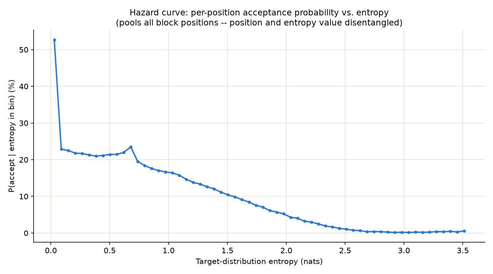
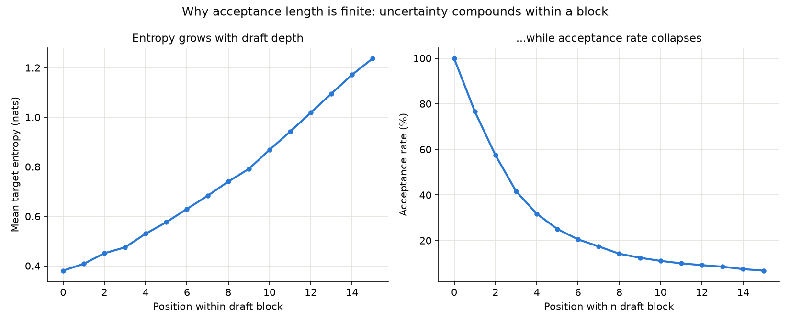
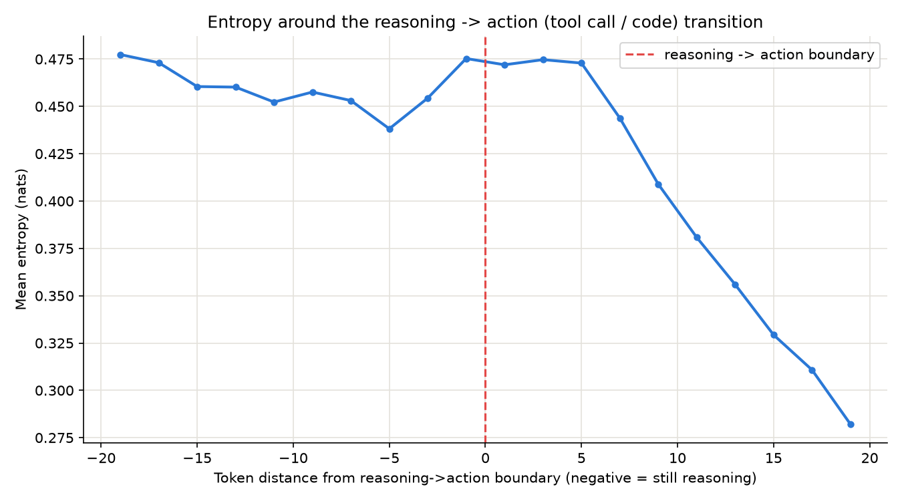
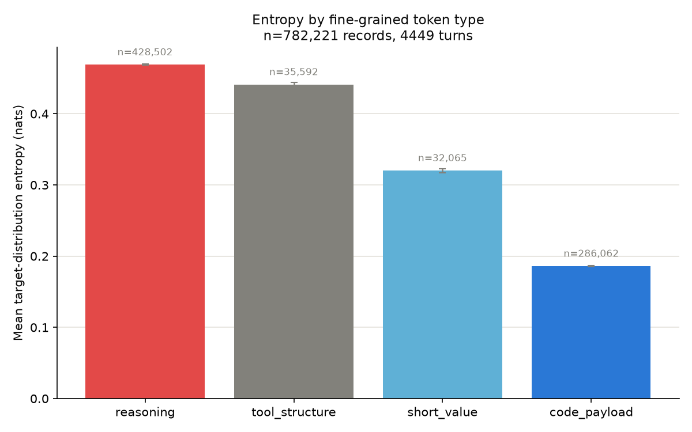
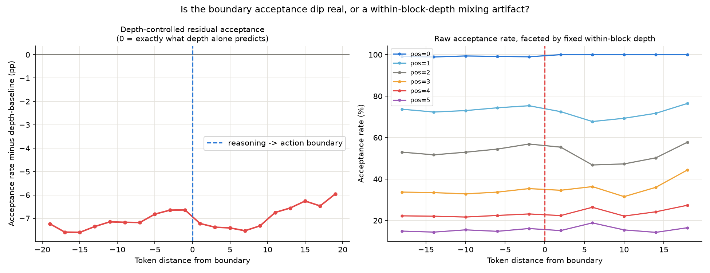

# Entropy and Speculative Decoding: DFlash vs. Eagle3

*Analysis of target-model uncertainty and speculative-decoding acceptance, across three model pairings, using SWE-bench-verified agent trajectories (mini-swe-agent).*

---

## TL;DR

- **Acceptance vs. entropy is a cliff, not a slope.** The moment the target model has *any* real uncertainty, acceptance rate roughly halves immediately (e.g. 56% → ~23%). Beyond that initial cliff, more uncertainty makes things worse only gradually.
- **Confidence collapses fast within a draft block.** Position 0 of a block is accepted ~99.9% of the time; by position 3 it's already down to 20-48% depending on the drafter.
- **Reasoning tokens carry 3-4x more entropy than action tokens** (tool calls / code) — consistently, across every model tested.
- **DFlash2 (diffusion drafter) beats Eagle3 (AR drafter) at every matched depth**, on the same target model (Qwen3-8B): higher per-position acceptance, higher mean accepted length (3.23 vs 2.25 tokens).
- **But held at the same entropy level, Eagle3 is the better guesser — and the gap widens with uncertainty.** At entropy ≈1.9-2.2, Eagle3 accepts roughly 5x as often as DFlash2 does at that same uncertainty level. DFlash2's overall win comes from *avoiding* high-entropy situations more often, not from handling them better once they arrive.
- **Within a block, what predicts acceptance length differs by architecture.** For Eagle3, it's almost entirely the *average* entropy. For DFlash2, the *spread* of entropy across the block matters more than the average.
- **Caveat:** Qwen3-8B's native 40,960-token context window caused 35-45% of SWE-bench episodes to error out mid-task (both speculators) — smaller than the original 30B model's effective context by a large margin, and it biases some of the longer-context comparisons.

---

## Setup

| | muse-glimmer (baseline) | Eagle3 | DFlash2 |
|---|---|---|---|
| Target model | muse-glimmer-30B | Qwen3-8B | Qwen3-8B |
| Draft method | DFlash2 (diffusion) | Eagle3 (autoregressive) | DFlash2 (diffusion) |
| Draft checkpoint | muse-glimmer-30b-dflash2 | RedHatAI/Qwen3-8B-speculator.eagle3 | RedHatAI/Qwen3-8B-speculator.dflash2 |
| Speculative tokens / block | 15 (+1 verify) | 3 (+1 verify) | 7 (+1 verify) |
| Dataset | SWE-bench-verified, 50 tasks | same 50 tasks | same 50 tasks |
| Agent | mini-swe-agent | mini-swe-agent | mini-swe-agent |
| Trials completed / errored | 50 / — | 50 / 18 (context limit) | 50 / 22 (context limit) |
| Entropy records collected | ~6.9M | ~1.0M | ~1.9M |

Every drafted position, in every verification step, is logged with: the target model's exact Shannon entropy over its full vocabulary at that position, and whether the draft token there was accepted. Eagle3 and DFlash2 share the exact same target model and task set, making them the fair, controlled comparison; the muse-glimmer-30B numbers are included as a larger-scale reference point, not a matched comparison (different target model entirely).

---

## Verdict: Eagle3 vs. DFlash2 — is one actually better?

On the same target model and workload, **DFlash2 (diffusion) wins decisively on every acceptance-quality metric measured** — it's not really conditional within what we tested here:

| | Eagle3 (AR) | DFlash2 (diffusion) |
|---|---|---|
| Acceptance at pos 0 | 99.9% | 99.8% *(tied)* |
| Acceptance at pos 1 | 70.8% | **76.0%** |
| Acceptance at pos 2 | 41.5% | **59.0%** |
| Acceptance at pos 3 | 20.9% | **48.5%** |
| Mean accepted length | 2.25 tokens | **3.23 tokens** |

The gap *widens* with depth, and DFlash2 achieves this while drafting more than twice as many tokens per block (7 vs 3) — normally a harder task, not an easier one. Position 0 is a dead heat; DFlash2's advantage only shows up once there's real uncertainty to navigate, and it holds up better at every depth beyond that.

**But there's a sharper nuance underneath this, and it flips the framing.** §2 below shows that when you hold *entropy itself* fixed instead of position — i.e. ask "given this exact level of target-model uncertainty, who guesses right more often" — **Eagle3 wins, by an increasingly large margin as entropy rises.** DFlash2's overall advantage above isn't because it handles uncertainty better; it's because it *encounters* less of it. At a given depth within a block, DFlash2 tends to be sitting at lower entropy than Eagle3 is at that same depth — its block-parallel drafting keeps confidence higher for longer, structurally. But once genuine uncertainty does show up, DFlash2 is the worse guesser of the two, and the gap between them grows the more uncertain the target model gets.

**What this study did *not* measure, and why that matters for a real "which is better" call:**

1. **Wall-clock throughput / draft-side compute cost.** Eagle3's draft head is a single transformer layer; DFlash2's is 5 layers plus block-diffusion machinery (mask tokens, conv groups, a selector). A higher acceptance rate only translates to real speedup if the extra draft-side compute doesn't eat the gains — we logged acceptance and entropy, not latency, so this is genuinely unknown from this data alone.
2. **Simplicity of the online signal.** Eagle3's block outcome is governed almost entirely by mean entropy (§7: partial corr with spread ≈ -0.004) — trivial to build an adaptive early-stopping heuristic around. DFlash2's outcome depends on spread as much as mean, which is a more complex signal to act on in production.
3. **Scope.** One workload (agentic SWE-bench coding), one target scale (8B). The muse-glimmer-30B run is DFlash2-only at a different target model, so it can't confirm whether DFlash2's edge holds at larger scale — it's included as a scale reference point, not part of this comparison.

If the goal is a production decision rather than an acceptance-quality comparison, the natural next step is measuring real per-step latency for both drafters and computing effective tokens/sec, not just acceptance rate.

---

## 1. Entropy vs. acceptance is a cliff, not a slope

Binning every drafted position directly by its entropy (not by block position) and asking "what fraction got accepted" reveals a sharp discontinuity, not a smooth decline:

| | near-zero entropy | just above zero | further decline |
|---|---|---|---|
| muse-glimmer-30B | 53% accept | → 23% accept | gradual, down to <1% by entropy ≈2.5 |
| Eagle3 (Qwen3-8B) | 74% accept | → 35% accept | smooth, monotonic decline to ~0% by entropy ≈2.0 |
| DFlash2 (Qwen3-8B) | 69% accept | → 16% accept | **non-monotonic**: dips to 14%, partially recovers to ~20-23% over the next few bins, then resumes a smooth decline to ~0% by entropy ≈2.0 (long tail out to entropy ≈7.5) |

The big loss in acceptance odds happens the instant the model leaves *complete* certainty — not from getting *more* uncertain afterward. In relative terms DFlash2's initial cliff is actually the **steeper** one of the two (69%→16%, falling to 23% of its peak, vs. Eagle3's 74%→35%, falling to 47% of its peak) — the opposite of what an earlier draft of this report claimed. But this aggregate, position-blind view is noisier than it looks: it mixes together positions of different depths within a block, which have very different baseline acceptance rates on their own (see §3). The depth-controlled comparison in §3 and §7 is the one to trust for "which drafter has the higher overall acceptance rate" — but §2, next, asks a different and sharper question: at *matched* entropy, not matched position, who actually guesses better?

Per-model plots: [`muse-glimmer/entropy_hazard_curve.png`](muse-glimmer/entropy_hazard_curve.png) / [`qwen3-eagle3/entropy_hazard_curve.png`](qwen3-eagle3/entropy_hazard_curve.png) / [`qwen3-dflash2/entropy_hazard_curve.png`](qwen3-dflash2/entropy_hazard_curve.png)
Cumulative view: [`muse-glimmer/entropy_survival_curve.png`](muse-glimmer/entropy_survival_curve.png) (and per-model equivalents)

---

## 2. Entropy-matched comparison: Eagle3 out-guesses DFlash2 under real uncertainty

Section 1's hazard curves are position-blind — they pool positions of every depth together, and depth alone drives a lot of the acceptance-rate difference (§3). To isolate the drafters' actual guessing quality, hold entropy fixed instead: at a *given* level of target-model uncertainty, which drafter's token matches the target's more often?

| entropy | Eagle3 accept | DFlash2 accept | Eagle3's edge |
|---|---|---|---|
| ~0.72 | 29.2% | 23.5% | +5.7pp |
| ~0.95 | 21.1% | 14.3% | +6.8pp |
| ~1.18 | 16.2% | 9.5% | +6.7pp |
| ~1.40 | 12.0% | 3.6% | +8.4pp (3.3x) |
| ~1.63 | 7.7% | 2.9% | 2.7x |
| ~1.92 | 3.4% | 0.7% | 4.9x |
| ~2.15 | 1.0% | 0.2% | 5x |

Eagle3 wins at essentially every entropy level above the near-zero floor, and its relative edge *grows* as entropy climbs — by entropy ≈1.9-2.2 it's accepting roughly 5x as often as DFlash2 at the same uncertainty level.

**This reconciles with §1's aggregate result rather than contradicting it.** DFlash2's overall lead (§3, §7) comes from *encountering* high entropy less often in the first place — at a given depth within a block, DFlash2 tends to be sitting at lower entropy than Eagle3 is at that same depth, likely a structural effect of drafting the whole block in one parallel, non-causal pass. But conditional on genuine uncertainty actually showing up, DFlash2 is the *worse* guesser of the two, and increasingly so. So: DFlash2 wins on staying confident longer; Eagle3 wins on handling it once confidence runs out.

---

## 3. Confidence collapses fast within a block

Acceptance at position *N* requires positions 0..N all to have been correct in a row, so it necessarily shrinks with depth — like a streak of coin flips. What differs by drafter is *how fast*:

| pos | Eagle3 (AR) | DFlash2 (diffusion) |
|---|---|---|
| 0 | 99.9% | 99.8% |
| 1 | 70.8% | 76.0% |
| 2 | 41.5% | 59.0% |
| 3 | 20.9% | 48.5% |
| 4-7 | — (block ends) | 41.7% → 31.6% |

DFlash2 decays more gracefully at every matched depth despite drafting more than twice as many tokens per block (7 vs 3 speculative tokens). Mean accepted length: **DFlash2 = 3.23 tokens, Eagle3 = 2.25 tokens.**

Plots: [`muse-glimmer/entropy_acceptance_by_position.png`](muse-glimmer/entropy_acceptance_by_position.png) and per-model equivalents in `qwen3-eagle3/` and `qwen3-dflash2/`.

---

## 4. Reasoning is uncertain; code and tool-calls are confident

Splitting each assistant turn into "reasoning" (chain-of-thought, including inline `<think>...</think>` for Qwen3) vs. "action" (tool calls, code, replies):

| | mean entropy: reasoning | mean entropy: action | ratio |
|---|---|---|---|
| muse-glimmer-30B | 0.469 | 0.189 | 2.5x |
| Eagle3 (Qwen3-8B) | 0.107 | 0.036 | 3.0x |
| DFlash2 (Qwen3-8B) | 0.102 | 0.027 | 3.8x |

The direction holds across every model tested. Absolute entropy is 5-10x lower on Qwen3-8B than the 30B model — the smaller model is just far more "peaked"/confident throughout, independent of speculator choice.

**The reasoning→action transition zone** (how long confidence takes to kick in after the model starts acting) differs by drafter: Eagle3's first 3 action tokens are barely more uncertain than mid-reasoning (+9%), while DFlash2 shows a much sharper spike right at the transition (+67%).

Plots: [`muse-glimmer/reasoning_vs_action_entropy.png`](muse-glimmer/reasoning_vs_action_entropy.png) and per-model equivalents.

---

## 5. Token-type breakdown: low-entropy scaffolding

Breaking the action channel down further into tool-call structure (JSON keys/punctuation, function names), short argument values (flags, paths), and long code/command payloads (heredocs, patches):

| category | muse-glimmer-30B | Eagle3 | DFlash2 |
|---|---|---|---|
| tool_structure | 0.441 | 0.058 | 0.046 |
| short_value | 0.320 | 0.010 | 0.006 |
| code_payload | 0.186 | 0.010 | 0.006 |

On the 30B model, short standalone values carry meaningfully *more* entropy than long code payloads (0.320 vs 0.186) — evidence that reproducing a long, already-decided code block is more "copying" than "deciding." **That gap essentially vanishes on both Qwen3-8B configs** (short_value ≈ code_payload, both near zero) — likely because the 8B model is near-deterministic almost everywhere on this benchmark, leaving little room for the effect to show up.

Plots: [`muse-glimmer/entropy_by_token_type.png`](muse-glimmer/entropy_by_token_type.png) and per-model equivalents.

---

## 6. The reasoning→action boundary has a real, but small and localized, acceptance dip

Using the muse-glimmer-30B data (where this was tested in most depth): naively, acceptance rate dips for ~10 tokens right after the reasoning→action switch (27% → 21%, back to 21.5%). But most of that dip is a **confound** — the mix of within-block depths being sampled shifts across that window, and deeper positions accept less regardless of *why* they're deep.

After controlling for within-block depth directly (comparing pos=1-to-pos=1, pos=2-to-pos=2, etc. before/after the boundary): a smaller, genuine effect survives — a 5-9 percentage point dip at early-to-mid block depths (positions 1-3), lasting ~6-10 tokens, fully recovering by ~15-18 tokens after the switch. Position 0 (the very first guess of any block) is completely unaffected.

Plots: [`muse-glimmer/acceptance_by_boundary_distance.png`](muse-glimmer/acceptance_by_boundary_distance.png), [`muse-glimmer/acceptance_by_boundary_controlled.png`](muse-glimmer/acceptance_by_boundary_controlled.png), and per-model equivalents.

---

## 7. AR vs. diffusion: what predicts a block's acceptance length differs structurally

Partial correlations at the block level — does the *spread* (std) of entropy within a block predict acceptance length, beyond what the *mean* already predicts?

| | Eagle3 (AR) | DFlash2 (diffusion) |
|---|---|---|
| partial corr(accepted_len, std \| mean) | **-0.004** (≈none) | **-0.38** (strong) |
| partial corr(accepted_len, mean \| std) | -0.20 | **+0.17** (sign flips) |

For **Eagle3**, once you know a block's average entropy, its spread adds almost nothing — acceptance length is governed almost entirely by the mean. For **DFlash2**, the opposite: spread dominates, and controlling for it, the mean barely matters. This tracks with how each drafter generates: Eagle3 produces tokens sequentially, each conditioned on the last, so it behaves like one evolving confidence level; DFlash2 drafts the whole block in parallel, so an uneven mix of easy/hard positions hurts it more than the average difficulty does.

Plots: [`muse-glimmer/entropy_variance_vs_acceptance.png`](muse-glimmer/entropy_variance_vs_acceptance.png) and per-model equivalents.

---

## Caveat: context-length effects are unreliable here

| | muse-glimmer-30B | Eagle3 | DFlash2 |
|---|---|---|---|
| context vs. acceptance, Pearson r | -0.036 | -0.151 | **+0.415** |
| % trials hitting context ceiling | 0% (200K+ context) | 36% | 44% |

Qwen3-8B's native context window (40,960 tokens) is far smaller than the 30B model's. Roughly 35-45% of both Qwen3-8B runs' SWE-bench episodes errored out from exceeding it mid-task. Turns that *do* reach long context in these runs are a survivorship-biased sample (only terser/better-behaved trajectories got there without erroring), which likely explains why the two 8B configs disagree with each other on the sign of this correlation. Not treated as a real finding — flagged as noise pending a cleaner test.

Plots: [`muse-glimmer/context_length_vs_acceptance.png`](muse-glimmer/context_length_vs_acceptance.png) and per-model equivalents.

---

## Methodology notes

- Entropy = exact Shannon entropy of the target model's full-vocab softmax distribution at each verification step, logged by a vLLM plugin patched into `RejectionSampler.__call__` (`muse_glimmer/entropy_plugin.py`). Independent of the draft model's own confidence.
- "Reasoning" vs "action" split: muse-glimmer used a separate `reasoning_content` API field; Qwen3 inlines reasoning as `<think>...</think>` inside `content` — both are parsed into the same categories for a fair comparison.
- All source scripts are in `analysis/*.py`, parameterized by `ENTROPY_LOG` / `JOB_DIR` / `TOKENIZER_PATH` / `ANALYSIS_OUT_DIR` env vars so they run unmodified against any of the three datasets.
- Raw data: `entropy_log.jsonl` (muse-glimmer-30B) and `logs/entropy_log_qwen3_{eagle3,dflash2}.jsonl`; per-task trajectories under `jobs/`.
